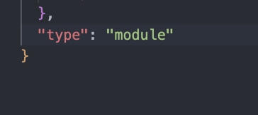

# setup using express

1. Initialize a nodejs

```
npm init -y
```

2. Install Express: Run the following command to install Express:

```
npm install express
```

3. use NodeMon: Nodemon is a tool that automatically restarts your Node.js application whenever you make changes to the code

```
npm install nodemon
```

4. i am using ` Modules (ESM) syntax` write this in `package.json`:
   

5. `.mjs` - is another way to indicate that a JavaScript file uses ECMAScript Modules (ESM) syntax

# Example of Express Servere

```
import express from 'express';

const app = express();

const PORT = 3000;

app.get('/', (req,res) => {
    res.send('Hello Express Developer.')
})

app.listen(PORT, () => {
    console.log(`Server is running at http://localhost:${PORT}`)
})
```
